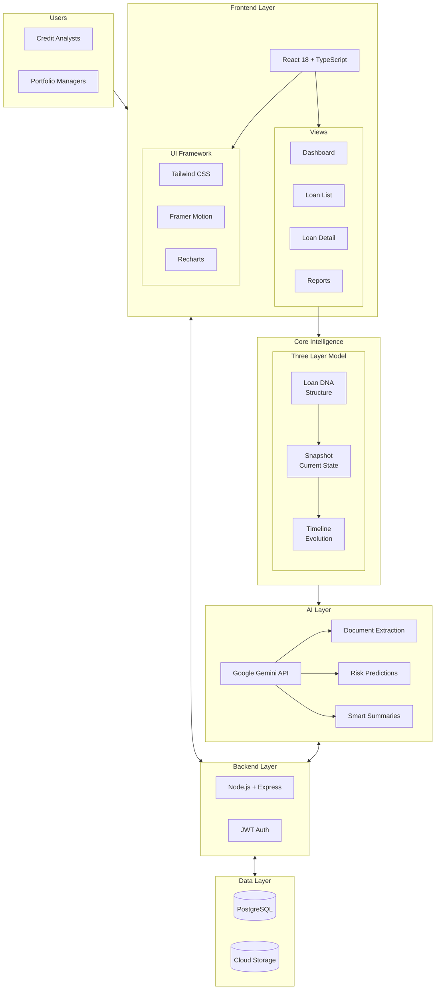

# Coven Architecture

```mermaid
flowchart TB
    subgraph Users["Users"]
        Analyst[Credit Analysts]
        Manager[Portfolio Managers]
    end

    subgraph Frontend["Frontend Layer"]
        React[React 18 + TypeScript]
        
        subgraph Views["Views"]
            Dashboard[Dashboard]
            LoanList[Loan List]
            LoanDetail[Loan Detail]
            Reports[Reports]
        end
        
        subgraph UI["UI Framework"]
            Tailwind[Tailwind CSS]
            Framer[Framer Motion]
            Recharts[Recharts]
        end
    end

    subgraph Core["Core Intelligence"]
        subgraph ThreeLayers["Three Layer Model"]
            DNA[Loan DNA<br/>Structure]
            Snapshot[Snapshot<br/>Current State]
            Timeline[Timeline<br/>Evolution]
        end
    end

    subgraph AI["AI Layer"]
        Gemini[Google Gemini API]
        
        Extract[Document Extraction]
        Predict[Risk Predictions]
        Summarize[Smart Summaries]
    end

    subgraph Backend["Backend Layer"]
        API[Node.js + Express]
        Auth[JWT Auth]
    end

    subgraph Data["Data Layer"]
        PostgreSQL[(PostgreSQL)]
        Storage[(Cloud Storage)]
    end

    Users --> Frontend
    React --> Views
    React --> UI
    
    Views --> Core
    DNA --> Snapshot
    Snapshot --> Timeline
    
    Core --> AI
    Gemini --> Extract
    Gemini --> Predict
    Gemini --> Summarize
    
    Frontend <--> Backend
    Backend <--> Data
    AI <--> Backend
```
